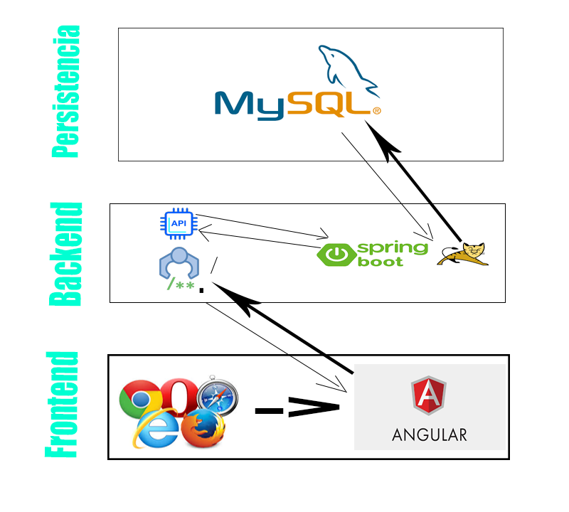
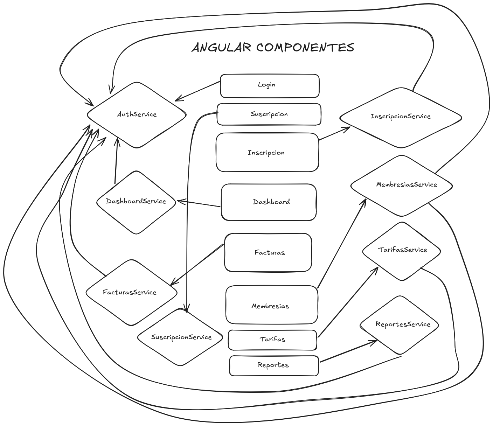

## Arquitectura del Sistema

### Diagrama de Arquitectura

### Descripción de Componentes Principales

1. **Frontend (Angular)**
   - **Descripción**: La interfaz de usuario desarrollada en Angular. Permite a los usuarios interactuar con el sistema a través de un navegador web.
   - **Responsabilidades**: 
     - Mostrar la información al usuario.
     - Enviar solicitudes al backend para obtener o enviar datos.
     - Gestionar la autenticación y autorización del usuario.

     

2. **Backend (Spring Boot)**
   - **Descripción**: La lógica del servidor, desarrollada en Spring Boot. Se encarga de procesar las solicitudes del frontend y manejar la lógica de negocio.
   - **Responsabilidades**: 
     - Exponer APIs RESTful para la comunicación con el frontend.
     - Gestionar la base de datos y la lógica de negocio.
     - Implementar la autenticación y autorización utilizando JWT.
     - Integrar con servicios externos, como SMTP para enviar correos electrónicos.

3. **Base de Datos (MySQL)**
   - **Descripción**: El sistema de gestión de bases de datos utilizado para almacenar la información del sistema.
   - **Responsabilidades**:
     - Almacenar datos relacionados con usuarios, membresías, facturas, etc.
     - Soportar consultas y operaciones transaccionales.

4. **Servicio de Envío de Correos (SMTP Gmail)**
   - **Descripción**: Servicio utilizado para enviar correos electrónicos desde el sistema.
   - **Responsabilidades**:
     - Enviar notificaciones y facturas por correo electrónico.

5. **Impresora Térmica**
   - **Descripción**: Dispositivo utilizado para imprimir tickets y recibos.
   - **Responsabilidades**:
     - Imprimir recibos de pagos y otros documentos relacionados.

