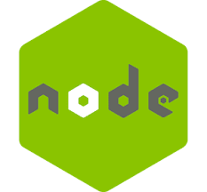

## Prerequisitos

Para poder ejecutar y desarrollar **SystemGYM**, es necesario cumplir con los siguientes prerequisitos:

### 1. Entorno de Desarrollo

- **Java 17**: Asegúrate de tener instalado JDK 17 para compilar y ejecutar el backend hecho en Spring Boot.

- **Angular 16**: La aplicación frontend está desarrollada en Angular 16. Necesitarás Node.js y Angular CLI instalados.

  - **Node.js**: Versión 14 o superior.

  - **Angular CLI**: Instalación global con `npm install -g @angular/cli`.

  

### 2. Base de Datos

- **MySQL**: 
  - Versión 8.0 o superior.
  - Configura una base de datos para el sistema y asegúrate de tener las credenciales a mano para configurar la conexión en Spring Boot.

    

### 3. Autenticación y Seguridad

- **JWT (JSON Web Tokens)**: El sistema utiliza JWT para la autenticación de usuarios, por lo que es importante configurar los tokens y claves secretas correctamente en el backend.

La configuracion de esta clave se hace en el archivo application.properties modificando la propiedad SECRET_KEY

### 4. Integración de Email

- **Gmail SMTP**: La aplicación está configurada para enviar correos electrónicos utilizando Gmail. Asegúrate de tener configuradas las credenciales correctas en Spring Boot, para poder utilizar tu correo electronico para enviar mensajes debes tener tu correo y la contraseña de aplicacion que provee gmail.

    

### 5. Impresión de Tickets

- **Impresora Térmica**: El sistema soporta la impresión de tickets a través de una impresora térmica. Asegúrate de tener instalada y configurada una impresora compatible, de 58mm.

    

### 6. Dependencias Adicionales

- **Maven**: Para manejar las dependencias en el proyecto Spring Boot.
- **npm**: Para manejar las dependencias del proyecto Angular.

### 7. Entorno de Ejecución

- **Servidor de Aplicaciones**: Un servidor como Tomcat para desplegar el backend de Spring Boot.
- **Navegador Web**: Cualquier navegador moderno para acceder a la aplicación frontend.
