## Casos de uso extendido

### Primer caso de uso extendido, Ingreso a la pagina web

 

### Segundo caso de uso extendido, Crear una membresia

 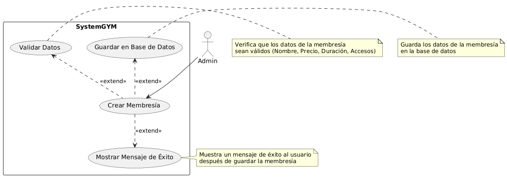

## Historias de usuario

# Historia de Usuario - Crear Membresía

| **Item**                          | **Descripción**                                         |
|-----------------------------------|---------------------------------------------------------|
| **ID**                            | HU-3bcd4561fgh4                                         |
| **Rol**                           | Administrador                                           |
| **Característica / Funcionalidad** | Crear membresía                                         |
| **Razón/Resultado**               | Permite crear o editar diferentes tipos de membresías   |

## HU-3bcd4561fgh4 - Criterios de Aceptación

| **Escenario**         | **Criterio de Aceptación**   | **Contexto**      | **Evento**         | **Resultado Esperado**                              |
|-----------------------|------------------------------|-------------------|--------------------|----------------------------------------------------|
| 1. Listar las membresías | Visualizar las membresías     | Menú Membresías    | Listar las membresías | Mostrar todas las membresías en el sistema            |
| 2. Crear membresía    | Crear nueva membresía         | Menú Crear         | Crear membresía     | Mostrar formulario de creación de membresía         |
| 3. Editar membresía   | Editar membresía              | Botón Editar       | Editar membresía    | Mostrar formulario con los datos de la membresía seleccionada y al presionar el boton de guardar debe actualizar los datos de la membresia |

## Cumplimiento punto 1

 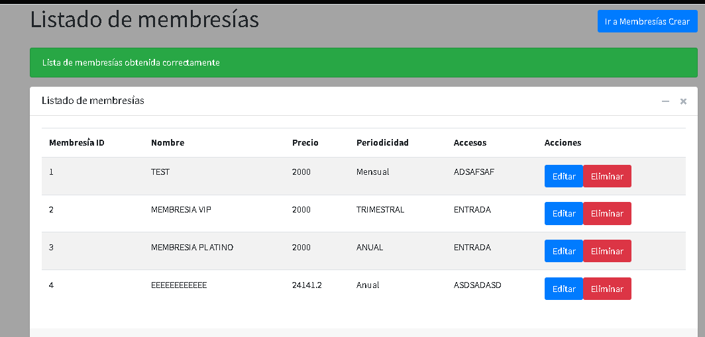

## Cumplimiento punto 2

 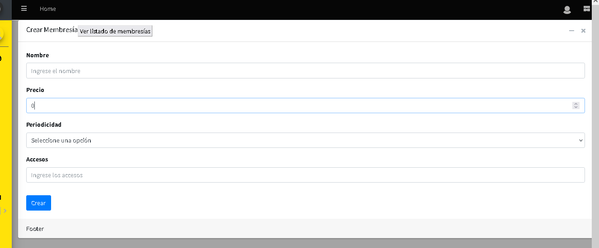
  

## Cumplimiento punto 3

 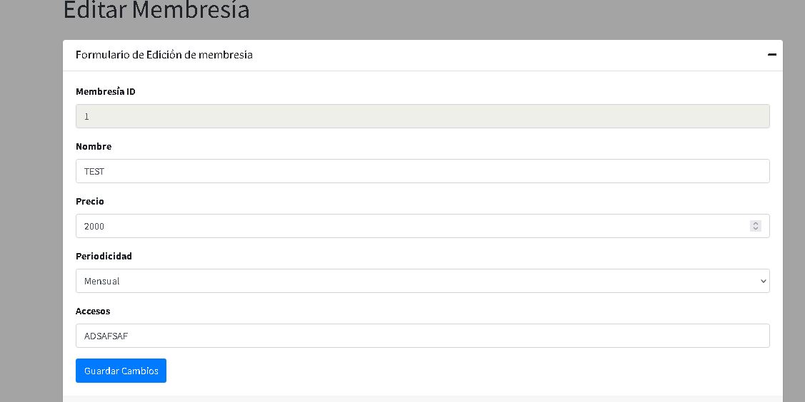
 

# Historia de Usuario - Inscribir cliente

| **Item**                          | **Descripción**                                         |
|-----------------------------------|---------------------------------------------------------|
| **ID**                            | HU-ins-cliente                                         |
| **Rol**                           | Administrador                                           |
| **Característica / Funcionalidad** | Inscribir Cliente                                         |
| **Razón/Resultado**               | Permite inscribir clientes al sistema y guardarlos en BD   |

## HU-ins-cliente  - Criterios de Aceptación

| **Escenario**         | **Criterio de Aceptación**   | **Contexto**      | **Evento**         | **Resultado Esperado**                              |
|-----------------------|------------------------------|-------------------|--------------------|----------------------------------------------------|
| 1. Inscribir al cliente | Cliente inscrito en bd y en la lista      | Menú Inscripcion    | Inscribir cliente | Cliente inscrito en el sistema |
| 2. Factura generada| Factura de inscripcion visualizable y descargable      | Menú Inscripcion    | Inscribir cliente correctamente | Factura descargada |

## Cumplimiento punto 1

 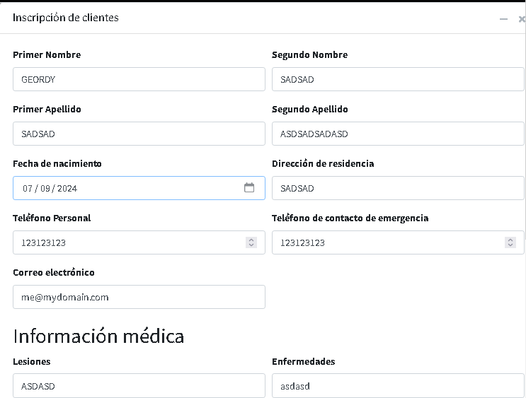
  
  
## Cumplimiento punto 2
  

  
# Historia de Usuario - Suscribir cliente

| **Item**                          | **Descripción**                                         |
|-----------------------------------|---------------------------------------------------------|
| **ID**                            | HU-3bcd4561fgh4                                         |
| **Rol**                           | Administrador                                           |
| **Característica / Funcionalidad** | Suscribir cliente a una membresia                                       |
| **Razón/Resultado**               | Permite suscribir un cliente a una membresia para que pueda acceder al gimnasio y a distintas partes con esa membresia y que se le facture por el periodo de dicha membresia |

## HU-3bcd4561fgh4 - Criterios de Aceptación

| **Escenario**         | **Criterio de Aceptación**   | **Contexto**      | **Evento**         | **Resultado Esperado**                              |
|-----------------------|------------------------------|-------------------|--------------------|----------------------------------------------------|
| 1. Cliente suscrito a la membresia | Cliente inscrito a la membresia que eligio y con factura pendiente     | Menú Suscripcion    | Suscribir a un cliente | Cliente inscrito a la membresia y con factura en base de datos           |

## Cumplimiento punto 1

 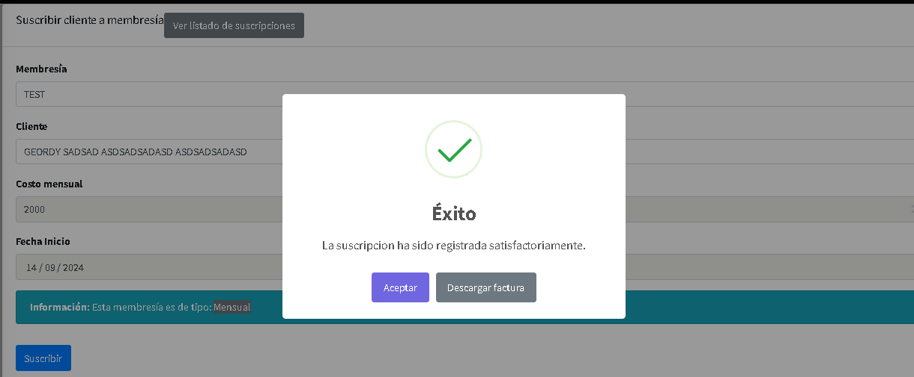
 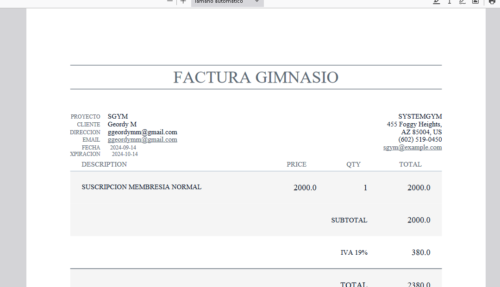

# Historia de Usuario - Pagar una factura

| **Item**                          | **Descripción**                                         |
|-----------------------------------|---------------------------------------------------------|
| **ID**                            | HU-3bcd4561fgh4                                         |
| **Rol**                           | Administrador                                           |
| **Característica / Funcionalidad** | Realizar un pago a una factura                                       |
| **Razón/Resultado**               | Permite realizar pagos a las facturas pendientes de los clientes |

## HU-3bcd4561fgh4 - Criterios de Aceptación

| **Escenario**         | **Criterio de Aceptación**   | **Contexto**      | **Evento**         | **Resultado Esperado**                              |
|-----------------------|------------------------------|-------------------|--------------------|----------------------------------------------------|
| 1. Factura pagada completamente | La factura pagada debe cambiar de estatus y se visualizar el pago en la lista    | Menú Pagos    | Pagar una factura | Pago guardado en base de datos y factura cambiada de status           |
| 2. Listado de pagos | Se deben listar los pagos realizados    | Menú Pagos    | Tocar el boton de Listar Pagos | Lista de pagos listada en una tabla          |

## Cumplimiento punto 1

 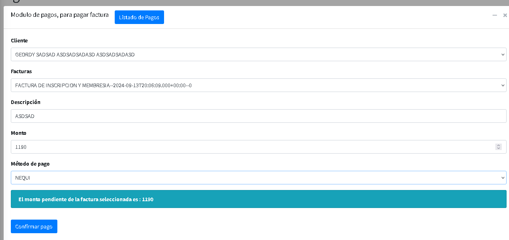
 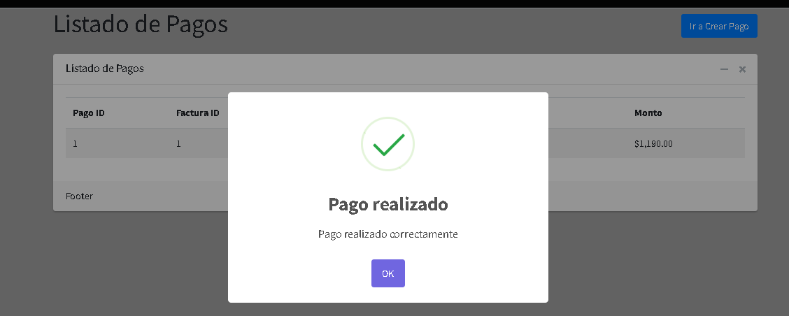

 ## Cumplimiento punto 2

  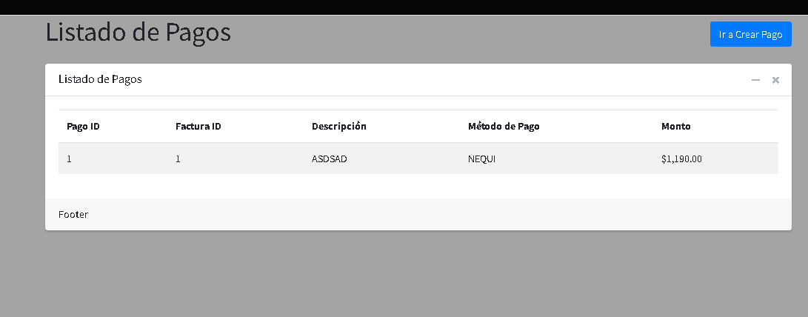

  # Historia de Usuario - Registrar Egreso

| **Item**                          | **Descripción**                                         |
|-----------------------------------|---------------------------------------------------------|
| **ID**                            | HU-3bcd4561fgh4                                         |
| **Rol**                           | Administrador                                           |
| **Característica / Funcionalidad** | Registrar los egresos del gimnasio    y eliminarlos                                   |
| **Razón/Resultado**               | Permite registrar los egresos de dinero del gimnasio, los gastos y tambien eliminarlos en caso de error |

## HU-3bcd4561fgh4 - Criterios de Aceptación

| **Escenario**         | **Criterio de Aceptación**   | **Contexto**      | **Evento**         | **Resultado Esperado**                              |
|-----------------------|------------------------------|-------------------|--------------------|----------------------------------------------------|
| 1. Egreso registrado en bd | El egreso debe ser guardado en base de datos    | Menú Egresos    | Registrar Egreso | Egreso creado en base de datos con la fecha actual           |
| 2. Listado de egresos | Se deben listar los egresos registrados   | Menú Egresos    | Tocar el boton de Listar Egresos | Lista de egresos listada en una tabla  |
| 3. Eliminar egreso | Se debe eliminar el egreso del sistema   | Menú Egresos    | Tocar el boton de eliminar y confirmar de la tabla | Egreso eliminado del sistema  |

## Cumplimiento punto 1
  

## Cumplimiento punto 2
  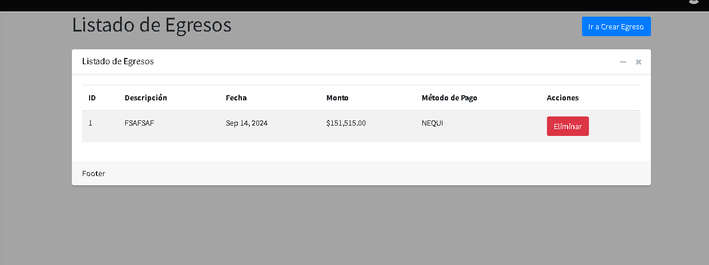

  ## Cumplimiento punto 3
 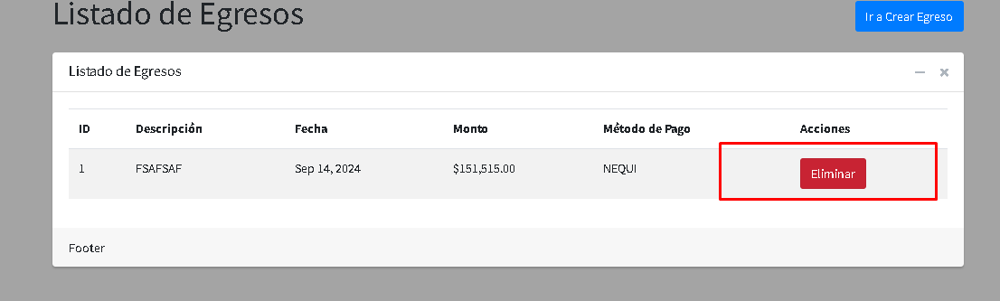
  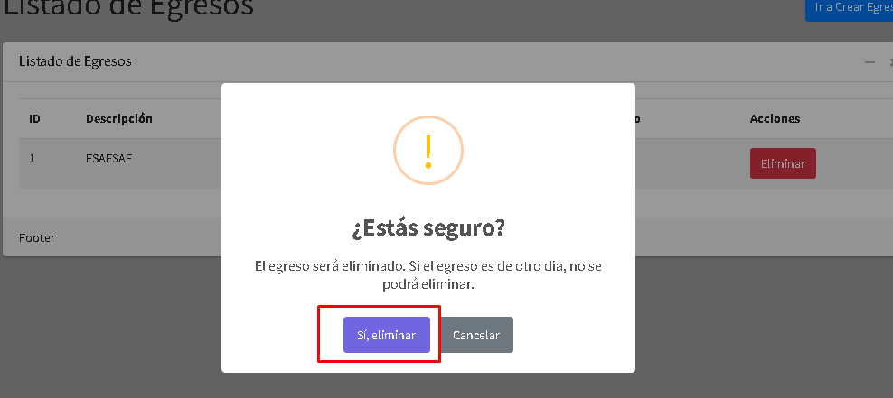
    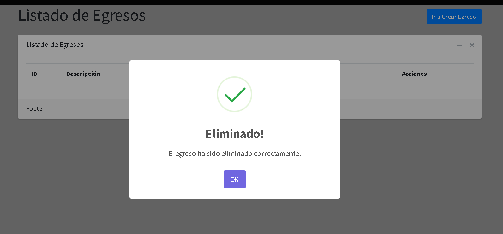

    
  # Historia de Usuario - Modificar tarifas

| **Item**                          | **Descripción**                                         |
|-----------------------------------|---------------------------------------------------------|
| **ID**                            | HU-3bcd4561fgh4                                         |
| **Rol**                           | Administrador                                           |
| **Característica / Funcionalidad** | Modificar las tarifas de los costos del sistema                     |
| **Razón/Resultado**               | Permite modificar los precios de las tarifas de las distintas tarifas del sistema |

## HU-3bcd4561fgh4 - Criterios de Aceptación

| **Escenario**         | **Criterio de Aceptación**   | **Contexto**      | **Evento**         | **Resultado Esperado**                              |
|-----------------------|------------------------------|-------------------|--------------------|----------------------------------------------------|
| 1. Tarifa con valor modificado | La tarifa debe modificarse y las proximas facturas deben salir con el nuevo valor de la tarifa    | Menú Tarifas    | Registrar Egreso | Tarifa con valor modificado           |

## Cumplimiento punto 1
  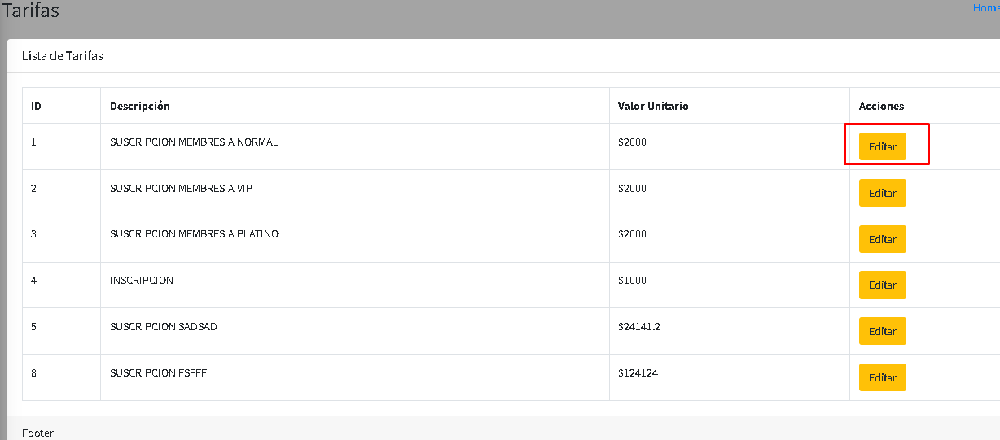
  
  
  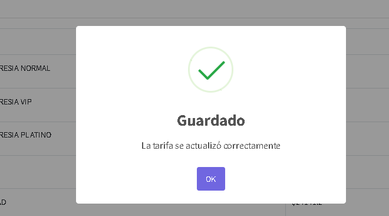

    
  # Historia de Usuario - Reportes Ingreso/Egreso

| **Item**                          | **Descripción**                                         |
|-----------------------------------|---------------------------------------------------------|
| **ID**                            | HU-3bcd4561fgh4                                         |
| **Rol**                           | Administrador                                           |
| **Característica / Funcionalidad** | Visualizar egresos y ingresos de una determinada fecha                     |
| **Razón/Resultado**               | Se deben poder visualizar en una tabla todos los ingresos y egresos de un determinado dia|

## HU-3bcd4561fgh4 - Criterios de Aceptación

| **Escenario**         | **Criterio de Aceptación**   | **Contexto**      | **Evento**         | **Resultado Esperado**                              |
|-----------------------|------------------------------|-------------------|--------------------|----------------------------------------------------|
| 1. Tabla listada con los egresos y ingresos del dia seleccionado | Se deben poder visualizar los egresos por un lado y los egresos por el otro   | Menú Reportes/Ingreso-Egreso    | Visualizar Ingreso/Egreso | Tabla con los datos de los ingresos y egresos           |

## Cumplimiento punto 1
  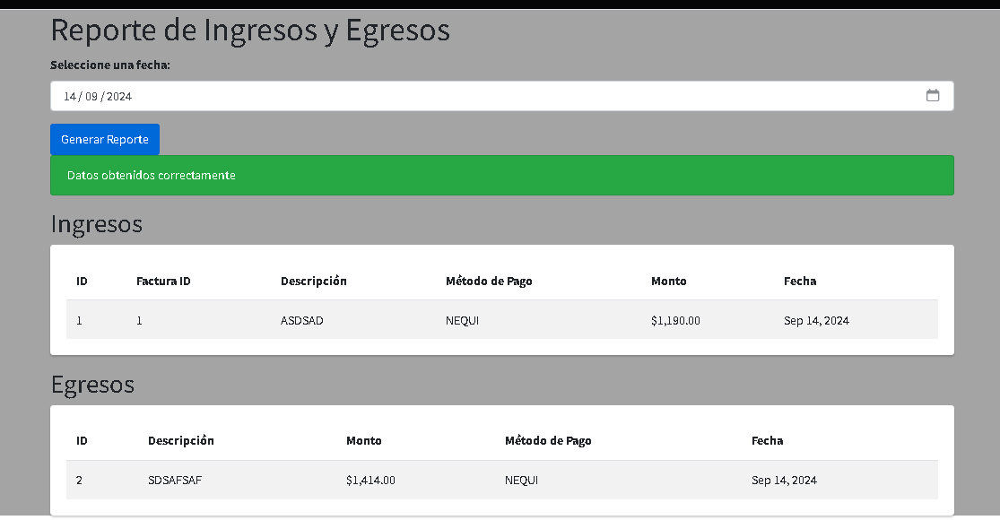
